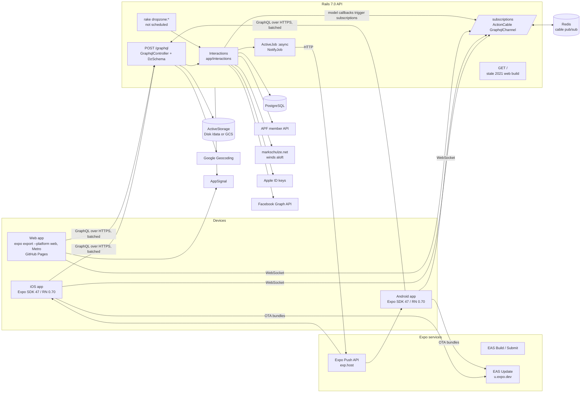
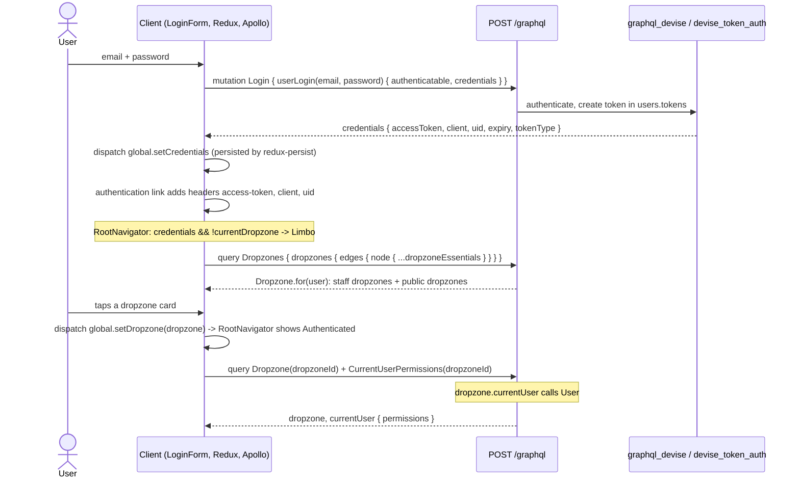
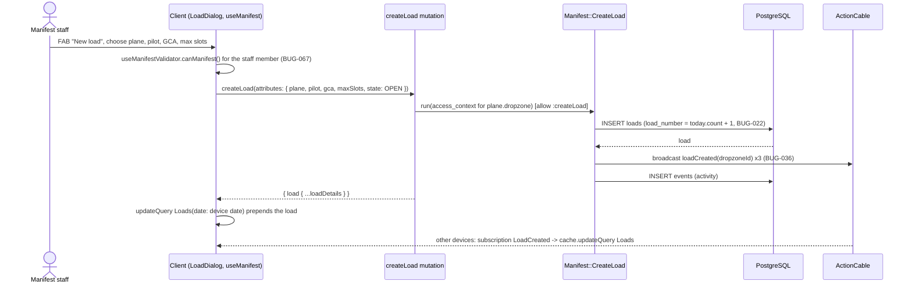
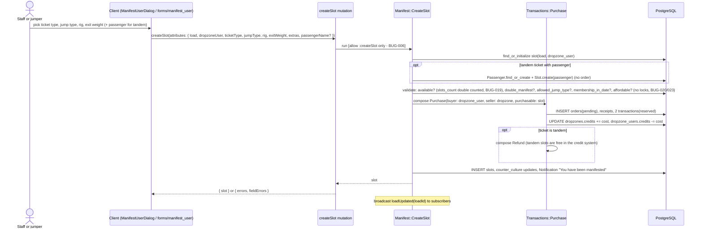
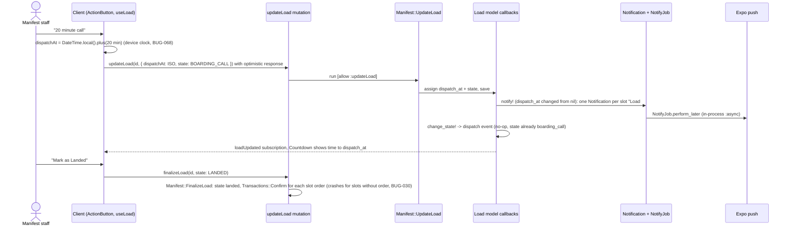
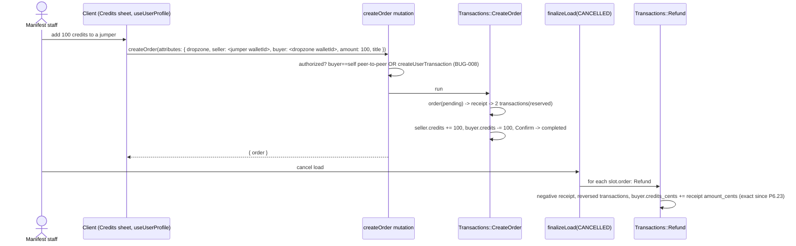
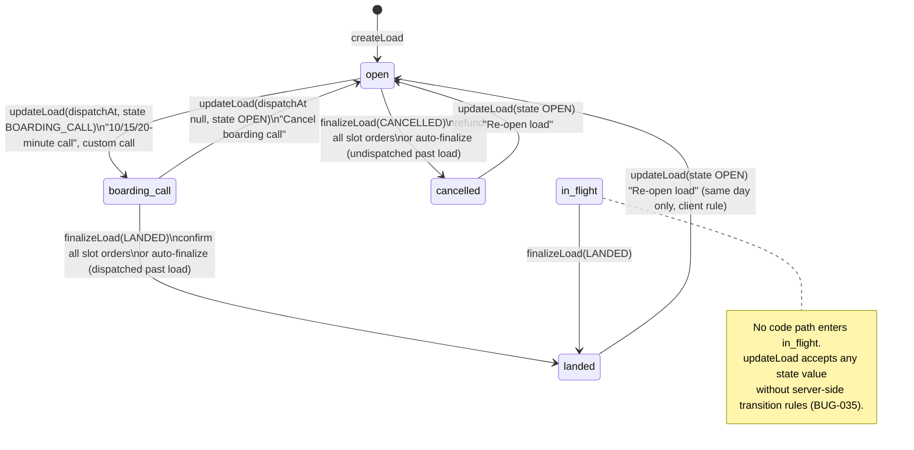
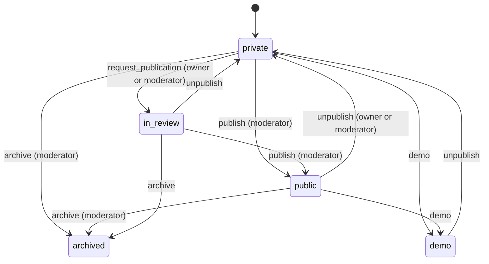
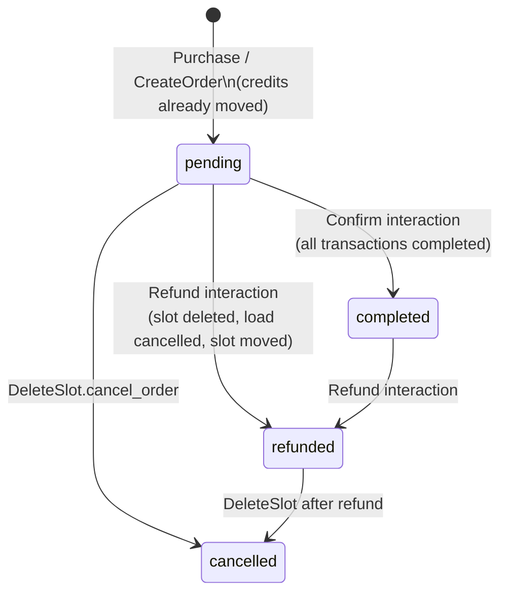

# OpenManifest diagrams

Mermaid diagrams for the system as it is at backend `b8dc33a` / client `3112795` (pass 1, 2026-10-08).
Client-only diagrams (navigation map, Redux data flow) are in the client repo:
<https://github.com/OpenManifest/openmanifest/blob/staging/docs/reference/diagrams.md>.

Contents: [1 System context](#1-system-context) · [2 ER diagram](#2-entity-relationship-diagram) ·
[3 Sequence diagrams](#3-sequence-diagrams) · [4 Client navigation map](#4-client-navigation-map) ·
[5 Redux data flow](#5-redux-data-flow) · [6 State diagrams](#6-state-diagrams)

## 1. System context

## 2. Entity relationship diagram

Derived from `db/schema.rb` (version `2023_04_09_034757`). Only key columns shown; `created_at`/`updated_at` omitted.
`admins` and the ActiveStorage tables are omitted.

```mermaid
erDiagram
  FEDERATIONS ||--o{ LICENSES : has
  FEDERATIONS ||--o{ QUALIFICATIONS : has
  FEDERATIONS ||--o{ DROPZONES : "federation_id"
  LICENSES ||--o{ LICENSED_JUMP_TYPES : allows
  JUMP_TYPES ||--o{ LICENSED_JUMP_TYPES : ""
  USERS ||--o{ USER_FEDERATIONS : ""
  FEDERATIONS ||--o{ USER_FEDERATIONS : ""
  LICENSES ||--o{ USER_FEDERATIONS : "license_id"
  USER_FEDERATIONS ||--o{ USER_FEDERATION_QUALIFICATIONS : ""
  QUALIFICATIONS ||--o{ USER_FEDERATION_QUALIFICATIONS : ""
  USERS ||--o{ AUTHENTICATION_PROVIDERS : ""
  USERS ||--o{ DROPZONE_USERS : "membership"
  DROPZONES ||--o{ DROPZONE_USERS : ""
  USER_ROLES ||--o{ DROPZONE_USERS : "user_role_id"
  LICENSES ||--o{ DROPZONE_USERS : "license_id"
  DROPZONES ||--o{ USER_ROLES : ""
  USER_ROLES ||--o{ USER_ROLE_PERMISSIONS : ""
  PERMISSIONS ||--o{ USER_ROLE_PERMISSIONS : ""
  DROPZONE_USERS ||--o{ USER_PERMISSIONS : ""
  PERMISSIONS ||--o{ USER_PERMISSIONS : ""
  DROPZONES ||--o{ PLANES : ""
  PLANES ||--o{ LOADS : "plane_id (only link load->dropzone)"
  DROPZONE_USERS ||--o{ LOADS : "pilot_id / gca_id / load_master_id"
  LOADS ||--o{ SLOTS : ""
  DROPZONE_USERS ||--o{ SLOTS : "dropzone_user_id / created_by_id"
  PASSENGERS ||--o{ SLOTS : "passenger_id"
  SLOTS ||--o| SLOTS : "passenger_slot_id"
  TICKET_TYPES ||--o{ SLOTS : ""
  JUMP_TYPES ||--o{ SLOTS : ""
  RIGS ||--o{ SLOTS : ""
  DROPZONES ||--o{ PASSENGERS : ""
  DROPZONES ||--o{ TICKET_TYPES : ""
  DROPZONES ||--o{ EXTRAS : ""
  TICKET_TYPES ||--o{ TICKET_TYPE_EXTRAS : ""
  EXTRAS ||--o{ TICKET_TYPE_EXTRAS : ""
  SLOTS ||--o{ SLOT_EXTRAS : "never written"
  EXTRAS ||--o{ SLOT_EXTRAS : ""
  USERS ||--o{ RIGS : "user_id (personal rig)"
  DROPZONES ||--o{ RIGS : "dropzone_id (DZ rig)"
  RIGS ||--o{ PACKS : ""
  USERS ||--o{ PACKS : ""
  RIGS ||--o{ RIG_INSPECTIONS : ""
  DROPZONE_USERS ||--o{ RIG_INSPECTIONS : "owner / inspected_by_id"
  FORM_TEMPLATES ||--o{ RIG_INSPECTIONS : ""
  DROPZONES ||--o{ FORM_TEMPLATES : ""
  DROPZONES |o--o| FORM_TEMPLATES : "rig_inspection_template_id"
  DROPZONES ||--o{ WEATHER_CONDITIONS : ""
  DROPZONES ||--o{ MASTER_LOGS : ""
  DROPZONE_USERS ||--o{ MASTER_LOGS : "dzso_id"
  DROPZONES ||--o{ ORDERS : "dropzone_id"
  ORDERS ||--o{ RECEIPTS : ""
  RECEIPTS ||--o{ TRANSACTIONS : ""
  DROPZONE_USERS ||--o{ NOTIFICATIONS : "received_by_id / sent_by_id"
  DROPZONES ||--o{ EVENTS : ""
  DROPZONE_USERS ||--o{ EVENTS : "dropzone_user_id"

  DROPZONES {
    bigint id PK
    string name
    bigint federation_id FK
    float lat
    float lng
    string time_zone "default Australia/Brisbane"
    string state "private|in_review|public|demo|archived"
    jsonb settings
    boolean is_credit_system_enabled
    integer credits "money as integer"
    integer users_count
    integer loads_count
    integer slots_count
    datetime discarded_at
  }
  USERS {
    bigint id PK
    string email UK
    string name
    string phone
    float exit_weight "kg"
    string push_token
    integer moderation_role
    integer jump_count
    string provider
    string uid
  }
  DROPZONE_USERS {
    bigint id PK
    bigint user_id FK
    bigint dropzone_id FK
    bigint user_role_id FK
    bigint license_id FK
    float credits "money as float"
    datetime expires_at "membership expiry"
    integer jump_count
    datetime discarded_at
  }
  PLANES {
    bigint id PK
    bigint dropzone_id FK
    string name
    string registration
    integer min_slots
    integer max_slots
    datetime discarded_at
  }
  LOADS {
    bigint id PK
    bigint plane_id FK
    integer load_number
    string name
    integer max_slots
    integer state "open|boarding_call|in_flight|landed|cancelled"
    datetime dispatch_at
    boolean has_landed
    boolean is_open
    bigint pilot_id FK
    bigint gca_id FK
    bigint load_master_id FK
    bigint slots_count "double counted"
    bigint ready_slots_count
    datetime discarded_at
  }
  SLOTS {
    bigint id PK
    bigint load_id FK
    bigint dropzone_user_id FK
    bigint passenger_id FK
    bigint passenger_slot_id FK
    bigint ticket_type_id FK
    bigint jump_type_id FK
    bigint rig_id FK
    float exit_weight
    integer group_number
    bigint created_by_id FK
  }
  TICKET_TYPES {
    bigint id PK
    bigint dropzone_id FK
    string name
    float cost
    string currency
    integer altitude "feet"
    boolean allow_manifesting_self
    boolean is_tandem
  }
  EXTRAS {
    bigint id PK
    bigint dropzone_id FK
    string name
    float cost
  }
  RIGS {
    bigint id PK
    bigint user_id FK
    bigint dropzone_id FK
    integer rig_type "student|sport|tandem"
    integer canopy_size "sq ft"
    datetime repack_expires_at
    boolean is_public
  }
  ORDERS {
    bigint id PK
    bigint dropzone_id FK
    string buyer_type
    bigint buyer_id
    string seller_type
    bigint seller_id
    string item_type
    bigint item_id
    integer order_number
    integer state
    float amount
  }
  TRANSACTIONS {
    bigint id PK
    bigint receipt_id FK
    string sender_type
    bigint sender_id
    string receiver_type
    bigint receiver_id
    float amount
    integer status
    integer transaction_type
  }
  WEATHER_CONDITIONS {
    bigint id PK
    bigint dropzone_id FK
    text winds "JSON altitude/speed/direction"
    integer temperature
    integer jump_run "degrees"
    integer exit_spot_miles
    integer offset_miles
    integer offset_direction
  }
  NOTIFICATIONS {
    bigint id PK
    bigint received_by_id FK
    bigint sent_by_id FK
    string resource_type
    bigint resource_id
    integer notification_type
    boolean is_seen
  }
  EVENTS {
    bigint id PK
    bigint dropzone_id FK
    bigint dropzone_user_id FK
    string resource_type
    bigint resource_id
    integer action
    integer level
    integer access_level
    text message
  }
```

## 3. Sequence diagrams

### 3.1 Login and session bootstrap

### 3.2 Creating a load

### 3.3 Adding a jumper to a load (manifest user)

### 3.4 Boarding call (departure call) and take-off

### 3.5 Credits top-up and refund on cancellation

## 4. Client navigation map

See client repo `docs/reference/diagrams.md` §1.

## 5. Redux data flow

See client repo `docs/reference/diagrams.md` §2.

## 6. State diagrams

### 6.1 Load (effective behaviour)

### 6.2 Dropzone visibility (`state_machines`, `app/models/concerns/state_machines/dropzone_state.rb`)

### 6.3 Order and transactions

